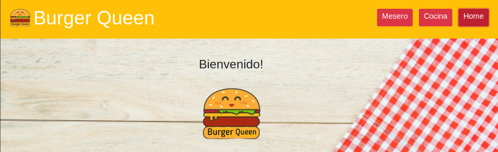

# Burger Queen
 

## Indice

* Presentación del producto
* Funcionalidad
* Proceso de diseño
* Tecnologías usadas
 

## Presentación

Burger Queen fue creado pensando en facilitar la labor del mesero a la hora de tomar el pedido de algún comensal, con ello, agilizar el proceso entre el momento en que se realiza el pedido y la llegada de este a la mesa, por lo que además, ofrecemos una experiencia agradable al cliente.
Burger Queen está originalmente diseñado para tablets, sin embargo se puede visualizar perfectamente desde cualquier dispositivo.
 
## Funcionalidad

La interfaz presenta dos botones principales, "Mesero" y "Cocina".
Al dirigirnos a "Mesero", nos encontramos con la opción "desayuno" y "menú del día", cada una de estas opciones nos mostrará una lista con el menú correspondiente; al clickear cada una, se imprimirá en la pantalla la lista de pedidos con sus respectivos precios. Esto mismo, más el nombre del cliente, será enviado a la cocina por medio de un botón, para que quién esté encargado de preparar los pedidos, tenga conocimiento inmediato de lo que se está solicitando. De esta manera se agilizan los procesos, desde que el mesero toma el pedido hasta que llega a la cocina y se sirve al cliente.
 
## Proceso de diseño

Partimos diseñando un flujo que fuese con el que pudiésemos identificar una solución óptima para la problemática que queríamos abordar.

### Flujo

Y para visualizar mejor lo que queríamos finalmente plasmar en pantalla, realizamos los skecth o prototipos de baja fidelidad, que se muestran a continuación.

### Sketch

### Lo qué se puede ver en estos momentos en la plataforma

 

## Tecnologías usadas

* Este proyecto está hecho en **Angular 8**, que por defecto utiliza el lenguaje **TypeScript**.
* **HTML5**.
* **CSS** en compañía de **Bootstrap** y **Fontawsome** para los iconos dentro de los botones y otros estilos.
* Base de datos **Cloud Firestore** de **Firebase**, para lo cual utilizamos además la librería de node **Angularfire2**.
 

* Gaba González
